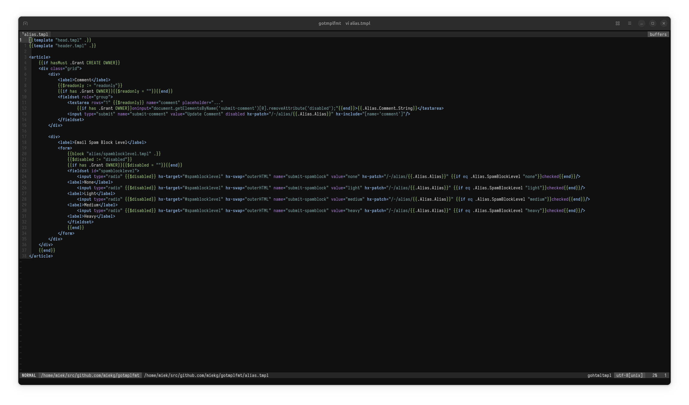
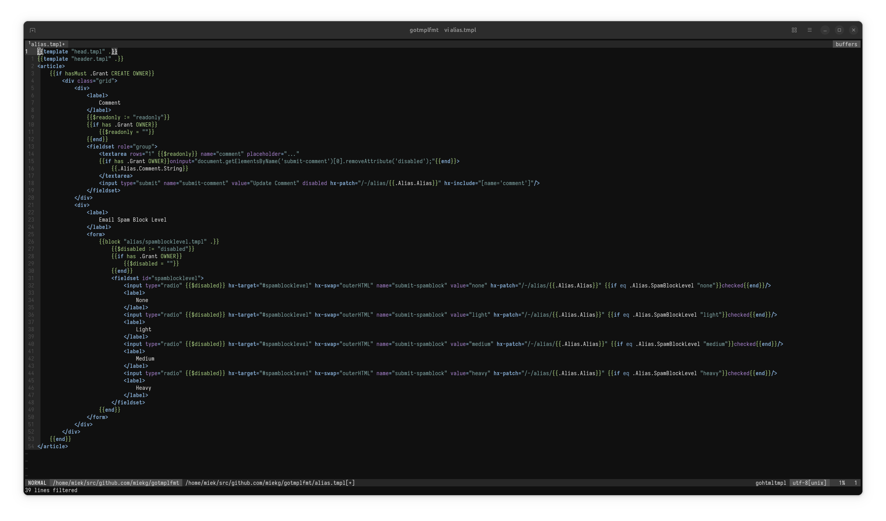

# gotmplfmt

Fmt Go HTML templates. There is one option. The indenting used is 1 tab - this allow your terminal's tab
width setting to do its work. The formatter is rather simple, there is no AST creation, it just iterates over
a list of tokens.

Both HTML tag and template verbs are used for the indentation; in a complete template this does what you
expect. For the HTML block tags: html, body, head, meta, main, nav we do not add a positive indent.

```gotmpl
{{if .X}}
    <body class="X">
{{else}}
    <body>
{{end}}
```

instead of:

```gotmpl
{{if .X}}
        <body class="X">
        {{else}}
                <body>
                {{end}}
```

where the second `<body>` would indent the template even further.

## Usage

1. `go build`
2. `./gotmplfmt < template.go.tmpl`

# Before



# After


