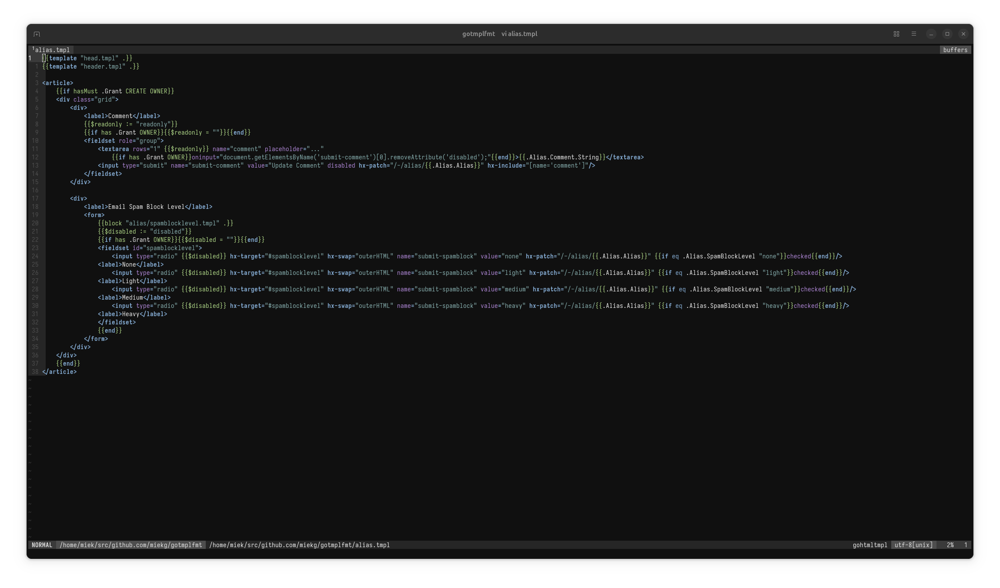
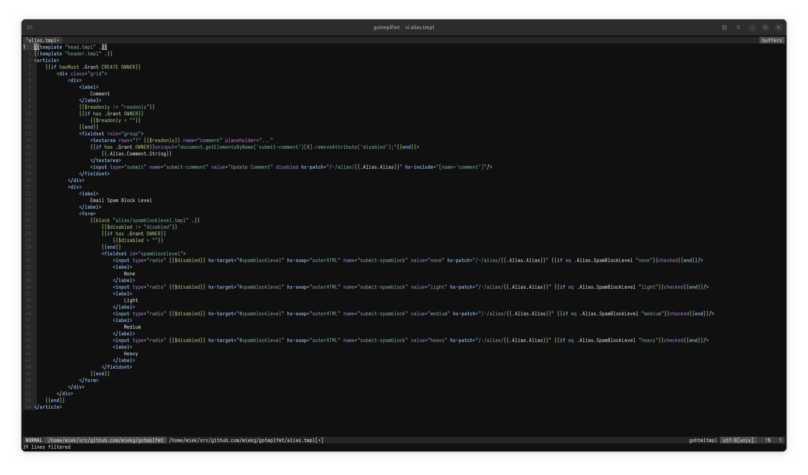

# gotmplfmt

Format Go HTML templates (\*.gotmpl).

Gotmplfmt only has one option (setting the width). The indenting used is 1 tab - this allow your editor's tab
setting to do its work. The formatter is rather simple, there is no AST creation, it just iterates over a list
of tokens. An AST was tried, but it being to smart/advanced it lead to problems, specifically usually the tree
is a broken AST, missing close tags. Also which AST? The template one, of the HTML one? And templates may be
partial which leads to more brokenness, hence a dumber approach was needed.

Before a {{block}} or {{define}} an extra newline is introduced.

Both HTML tag and template verbs are used for the indentation; in a complete template this does what you
expect. For the HTML block tags: html, body, head, meta, main, nav we do not add a positive indent.

```gotmpl
{{if .X}}
    <body class="X">
{{else}}
    <body>
{{end}}
```

instead of:

```gotmpl
{{if .X}}
        <body class="X">
        {{else}}
                <body>
                {{end}}
```

where the second `<body>` would indent the template even further.

`<style>` and `<script>` tag contents are not formatted, as they are usually
not HTML but CSS and JavaScript respectively.

This is to prevent the formatter from breaking the CSS and JavaScript code and
best left to something like Prettier.

## Usage

1. `go build`
2. `./gotmplfmt < template.go.tmpl`

# Before



# After


